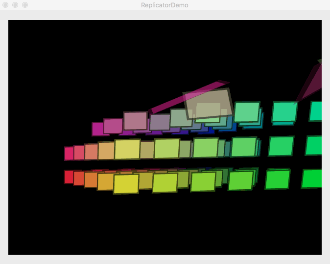
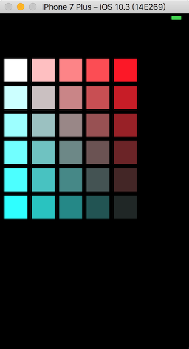
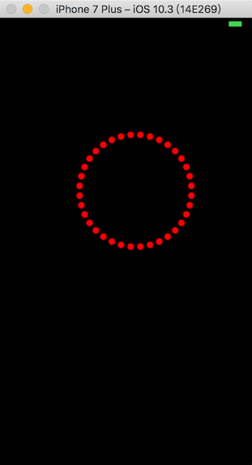
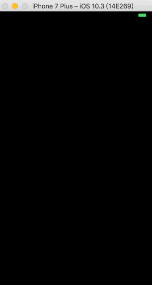

---

title: CAReplicatorLayer探究

date: 2017-05-06 18:17:14

---


## 概述

1. 这个layer干什么用的？
2. 这个layer如何用？
3. 何种场景适合这个layer发挥？

带着这些问题，我们上路，开始研究它。

<!--more-->

## 苹果官方demo



​	这个是我搜到的苹果对CAReplicatorLayer讲述功能时，使用到的demo，有没有吊炸天的感觉，但是实际上，我要告诉你的是，实现这样一个功能使用的代码不超过300行。

## 干什么用？

​	说实话，其实这个layer很偏门，基本上很少有人会用到它，它的主要作用是用来复制任意数量的它的sublayer的，sublayer是它复制的源头，如果没有sublayer那么是复制不了的。复制的方式，可能是几何变换、时间控制、颜色变换。

​	使用CAReplicatorLayer对象可以通过一个图片源构建复杂的布局，而仅仅是通过坐标转换、颜色转换、时间转换。

## 如何使用

1. **基础使用**

   多说无益，看代码吧

```objc
- (CAReplicatorLayer *)xReplicatorLayer
{
    // 创建原始图层，白色的大小 50，50
    CALayer *redLayer = [CALayer layer];
    redLayer.backgroundColor = [[UIColor whiteColor]CGColor];
    redLayer.frame = CGRectMake(0, 0, 50, 50);
    
    // 创建复制图层，并设置复制5个，复制转换为按横坐标偏移60，颜色为从白变为红
    CAReplicatorLayer *replicatorLayer = [CAReplicatorLayer layer];
    replicatorLayer.instanceCount = 5;
    replicatorLayer.instanceTransform = CATransform3DMakeTranslation(60, 0, 0);
    CGFloat step = - 1 / 5.f;
    replicatorLayer.instanceGreenOffset = step;
    replicatorLayer.instanceBlueOffset = step;
    [replicatorLayer addSublayer:redLayer];
    
    return replicatorLayer;
}

- (CAReplicatorLayer *)ReplicatorLayer
{
    // 获取经过X轴变换的layer
    CAReplicatorLayer *redLayer = [self xReplicatorLayer];
    
    // 做纵坐标变换，复制6次，变换方式为向上偏移60，颜色从红变灰
    CAReplicatorLayer *replicatorLayer = [CAReplicatorLayer layer];
    replicatorLayer.instanceCount = 6;
    replicatorLayer.instanceTransform = CATransform3DMakeTranslation(0, 60, 0);
    CGFloat step = -1 / 6.f;
    replicatorLayer.instanceRedOffset = step;
    [replicatorLayer addSublayer:redLayer];
    
    return replicatorLayer;
}

- (void)viewDidLoad {
    [super viewDidLoad];
    self.view.backgroundColor = [UIColor blackColor];
    
    CAReplicatorLayer *replicatorLayer = [self ReplicatorLayer];
    replicatorLayer.frame = CGRectMake(10, 100, 50, 50);
    [self.view.layer addSublayer:replicatorLayer];
    

}
```

***实现效果，如下图***



除了做横纵坐标变换以外，还可以做旋转，代码如下

```objc
- (CAReplicatorLayer *)rotateReplicatorLayer
{
    CAReplicatorLayer *layer = [CAReplicatorLayer layer];
    layer.frame = CGRectMake(screen_width() / 2, screen_height() / 2, w_16, h_16);
    CALayer *content = [CALayer layer];
    content.opacity = 1;
    content.frame = layer.bounds;
    content.contents = (id)[[UIImage imageNamed:@"brightBlob.png"]CGImage];
    
    layer.instanceCount = 36;
    layer.instanceColor = [[UIColor redColor]CGColor];
    CATransform3D transform = CATransform3DMakeTranslation(16, 0, 0);
    layer.instanceTransform = CATransform3DRotate(transform, -M_PI * 10 / 180, 0, 0, 1);
    [layer addSublayer:content];
    
    return layer;
}
```

***效果图如下***



2. **进阶使用**

   使用该类可以实现粒子发射器的效果，结合动画的使用，加上旋转、位移变换，可以实现类似游戏中的粒子发射器的效果。此处需要定义一个CYEmitterLayer类，该类要继承自CAReplicatorLayer。很显然，我要对CAReplicatorLayer进行功能扩展。让它具备开始发射粒子和停止发射粒子的功能。

   ```objc
   #import <QuartzCore/QuartzCore.h>

   @interface CYEmitterLayer : CAReplicatorLayer{}

   @property (nonatomic, strong) CALayer *imageLayer;  //作为原始层，供CAReplicatorLayer 复制
   @property (nonatomic, assign) CGFloat rotator;      //旋转因子，实现旋转功能
   @property (nonatomic, assign) CGFloat length;       //发射长度
   @property (nonatomic, assign) CGFloat count;        //一次发射的个数
   @property (nonatomic, assign) CGFloat angle;        //发射角度
   @property (nonatomic, assign) CGFloat cycleTime;    //循环时间
   @property (nonatomic, assign) CGFloat xAdjust;      //x轴调整
   @property (nonatomic, assign) CGFloat yAdjust;      //y轴调整

   - (void)start;

   - (void)stop;
   @end
     
   #import "CYEmitterLayer.h"
   #import <UIKit/UIKit.h>

   @implementation CYEmitterLayer
   - (id)init
   {
       self = [super init];
       if (self) {
           self.count = 1;
           self.imageLayer = [CALayer layer];
           self.imageLayer.contents = (id)[UIImage imageNamed:@"brightBlob"].CGImage;
           self.instanceColor = [[UIColor whiteColor]CGColor];
           [self addSublayer:self.imageLayer];
       }
       return self;
   }

   - (void)start
   {
       // 配置发射信息
       self.imageLayer.frame = self.bounds;
       self.imageLayer.opacity = 1.0f;
       self.instanceCount = self.count;
       self.instanceDelay = self.cycleTime / self.count;
       
       // 校准粒子与上个粒子之间的角度以及位置
       CATransform3D transform = CATransform3DMakeRotation(self.rotator, 0, 0, 1);
       self.instanceTransform = CATransform3DTranslate(transform, self.xAdjust, self.yAdjust, 0);
       
       // 校准发射源发射角度
       self.transform = CATransform3DMakeRotation(self.angle, 0, 0, 1);
       
       // 执行动画，实现发射效果
       [self animation];
   }

   - (void)animation
   {
       CGPoint newPoint = CGPointMake(0, self.length);
       CABasicAnimation *basic = [CABasicAnimation animation];
       basic.keyPath = @"position";
       basic.toValue = [NSValue valueWithCGPoint:newPoint];
       basic.duration = self.cycleTime;
       basic.repeatCount = MAXFLOAT;
       [self.imageLayer addAnimation:basic forKey:@"position"];
   }

   - (void)stop
   {
       self.imageLayer.opacity = 0;
       [self.imageLayer removeAllAnimations];
       self.instanceCount = 0;
   }
   @end
   ```

   这里是头文件的定义，我们扩展了动画执行时间、发射个数、发射角度、粒子旋转角度等基本属性，通过对这些基本属性的合理赋值，就可以实现发射粒子的功能了。我这里只写了俩个简单的用法，具体怎么实现更牛逼，更吊的效果就靠看官脑洞大开了。

   ***效果图如下***

   

   ​

## 何时使用？

​	我个人认为，这个类之所以没有在我们开发中经常出现，确实是有道理的，后面的粒子发射器，实际上苹果在ios5的时候已经引入了CAEmitterLayer来做这个功能，那么我们使用这个类的场景也就剩下静态的展示多个图层的时候使用了，此外要说的是，由于layer不能像UIView那样的响应触摸事件，带有交互的场景是不适合它的，好了，下面附上我在github上的demo地址，感兴趣的朋友可以[下载](https://github.com/TripleFireMan/CARepicatorLayerDemo.git)下来观看下。


​	另外，开场的苹果官方demo是用来镇场的 #35

## 参考资料

1. [官方资料](https://developer.apple.com/reference/quartzcore/careplicatorlayer?language=objc)