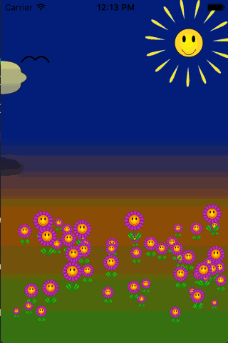
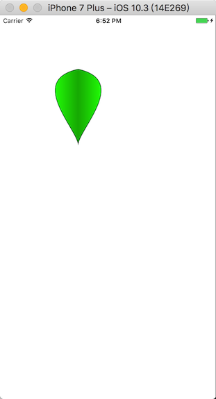
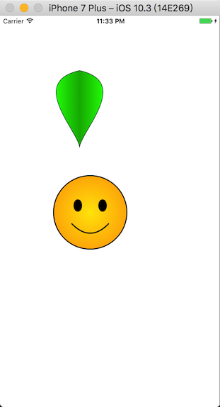
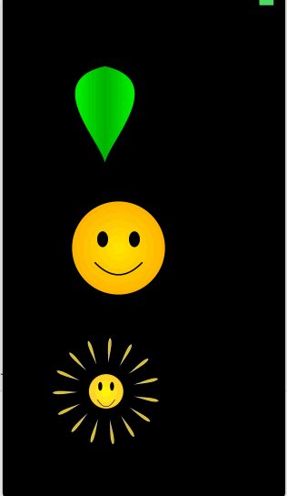
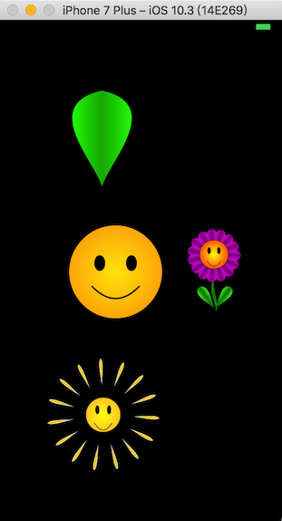

# 绘图

## 成品展示



<!--more-->

## UIBezierPath

说到绘图，那么有一个不得不讲的对象，那就是UIBezierPath。先来看几个UIBezierPath里面比较重要的API。我都已经做了注释，功能还是比较强大的。

```objc
+ (instancetype)bezierPath;//创建贝塞尔曲线
+ (instancetype)bezierPathWithRect:(CGRect)rect;//获取矩形的贝塞尔曲线
+ (instancetype)bezierPathWithOvalInRect:(CGRect)rect;//获取矩形框内椭圆的贝塞尔曲线
+ (instancetype)bezierPathWithRoundedRect:(CGRect)rect cornerRadius:(CGFloat)cornerRadius; //圆角贝塞尔曲线
+ (instancetype)bezierPathWithRoundedRect:(CGRect)rect byRoundingCorners:(UIRectCorner)corners cornerRadii:(CGSize)cornerRadii;//矩形框内，指定圆角、半径的贝塞尔曲线
+ (instancetype)bezierPathWithArcCenter:(CGPoint)center radius:(CGFloat)radius startAngle:(CGFloat)startAngle endAngle:(CGFloat)endAngle clockwise:(BOOL)clockwise;//指定圆心、半径、起始角度、时钟方向的贝塞尔曲线
+ (instancetype)bezierPathWithCGPath:(CGPathRef)CGPath;//根据CGPath创建贝塞尔曲线

- (instancetype)init NS_DESIGNATED_INITIALIZER;

- (void)moveToPoint:(CGPoint)point;//移动到某个点
- (void)addLineToPoint:(CGPoint)point;//从当前点，添加线段到目标点
- (void)addCurveToPoint:(CGPoint)endPoint controlPoint1:(CGPoint)controlPoint1 controlPoint2:(CGPoint)controlPoint2;//贝塞尔三次方程，从当前点，到目标点，受控制点1、控制点2控制
- (void)addQuadCurveToPoint:(CGPoint)endPoint controlPoint:(CGPoint)controlPoint;//贝塞尔二次方程，从当前点到目标点，受控制点1控制
- (void)addArcWithCenter:(CGPoint)center radius:(CGFloat)radius startAngle:(CGFloat)startAngle endAngle:(CGFloat)endAngle clockwise:(BOOL)clockwise NS_AVAILABLE_IOS(4_0);//添加椭圆路径，参数包括圆心，半径、开始角度，结束角度，时钟方向
- (void)closePath;//关闭路径，当前大多是子路径，收到该消息之后，都会将首位点连接起来。
- (void)fill;//填充封闭路径，根据当前context设置的颜色等参数
- (void)stroke;//划线，根据当前context设置的线宽啊，颜色啊等参数
- (void)addClip;//切边，调用该方法之后，只有封闭路径内可以继续操作，封闭路径外无法操作。

@end
```

## 梯度

梯度的实现在ios里面有俩种方式，一种是通过CAGradientLayer去绘制，一种是通过CGGradientRef使用DrawRect:方法去绘制，我这里采用的是第二种方式。

实现方式，首先创建了一个CYShapeView的基类，该类可以设置一些属性值，如外边界色，里边界色，划线色，线宽等。方便子类继承它。通过设置的这些属性，可以获取到需要的梯度Ref指针。

下面是具体的代码

```objc
@interface CYShapedView : UIView

@property (nonatomic, strong) UIColor *innerColor;
@property (nonatomic, strong) UIColor *outerColor;
@property (nonatomic, strong) UIColor *strokeColor;
@property (nonatomic, assign) CGFloat lineThickness;

- (CGGradientRef)gradientWithColor:(UIColor *)c1
                           toColor:(UIColor *)c2
                             count:(CGFloat)colorNumb;
@end
 
@implementation CYShapedView

- (id)initWithFrame:(CGRect)frame
{
    self = [super initWithFrame:frame];
    if (self) {
        self.innerColor = [UIColor redColor];
        self.outerColor = [UIColor yellowColor];
        self.strokeColor = [UIColor blackColor];
        self.lineThickness = 3.f;
        self.backgroundColor = [UIColor clearColor];
    }
    return self;
}

- (void)setLineThickness:(CGFloat)lineThickness
{
    CGFloat totalWidth = self.bounds.size.width;
    CGFloat totalHeight = self.bounds.size.height;
    CGFloat halfWidth = totalWidth / 2.f;
    CGFloat halfHeight = totalHeight / 2.f;
    CGFloat smallest = MIN(halfWidth, halfHeight);
    CGFloat factor = smallest / 100.f;
    factor = (factor > 1) ? 1 : factor;
    _lineThickness = factor * lineThickness;
}

- (CGGradientRef)gradientWithColor:(UIColor *)c1 toColor:(UIColor *)c2 count:(CGFloat)colorNumb
{
    // 获取颜色组成
    const CGFloat *colorComponents1 = CGColorGetComponents(c1.CGColor);
    CGFloat r1 = colorComponents1[0];
    CGFloat g1 = colorComponents1[1];
    CGFloat b1 = colorComponents1[2];
    
    const CGFloat *colorComponents2 = CGColorGetComponents(c2.CGColor);
    CGFloat r2 = colorComponents2[0];
    CGFloat g2 = colorComponents2[1];
    CGFloat b2 = colorComponents2[2];
    
    CGFloat gradientColorComponents[] = {
        r1,g1,b1,1,
        r2,g2,b2,1,
        r1,g1,b1,1,
    };
    
    // 使用RGB色生成颜色空间
    CGColorSpaceRef rgb = CGColorSpaceCreateDeviceRGB();
    // 根据RGB色和梯度色数组，以及梯度色个数，创建梯度引用
    CGGradientRef    gradientRef =  CGGradientCreateWithColorComponents(rgb, gradientColorComponents, NULL, colorNumb);
    CGColorSpaceRelease(rgb);
    
    return gradientRef;
}
@end
```

## 使用梯度及UIBezierPath绘制一个叶子

实现思路，创建一个继承自CYShapedView的子类，并将它命名为CYPetal。我们主要做的工作是在该类的DrawRect:方法里面

绘制一个叶子，首先要绘制的点有起点和终点，中间需要用曲线连接起来。那么接下来的工作就是找到这些点。

```objc
1. 起点（startPoint）：CGPointMake(self.view.bounds.size.width / 2, 3)
2. 终点（endPoint）：CGPointMake(self.view.bounds.size.width/ 2,self.view.bounds.size.height);
3. 左叶子控制点（leftCtl）：CGPointMake(-self.view.bounds.size.width / 2,self.view.bounds.size.height/ 3)
4. 右叶子控制点（rightCtl）：CGPointMake(self.view.bounds.size.width *1.5,self.view.bounds.size.height/ 3)
5. 中间控制点（midPoint）：CGPointMake(self.view.bounds.size.width / 2,self.view.bounds.size.height * 0.8)
6. 边界点（corner）：该点用来设置梯度的终点CGPointMake(self.view.bounds.size.width, 0)
```

下面来形象的展示下这些点的位置

```objc
/*---------------------------------------------------------------------------*/
//              -----------------------------------------
//              |                . -> start poin       .|corner
//   . left ctl |                                       |           . right ctl
//              |                                       |
//              |                                       |
//              |                                       |
//              |                                       |
//              |              mid point                |
//              |                .                      |
//              |                                       |
//              |                . -> end pint          |
//              -----------------------------------------
/*----------------------------------------------------------------------------*/
```

以下是具体的实现代码，其实找到点之后，再用代码实现就很容易了。

```objc
- (void)drawRect:(CGRect)rect {    
    CGFloat fullWidth = self.bounds.size.width;
    CGFloat fullHeight = self.bounds.size.height;
    CGFloat halfWidth = fullWidth / 2.f;
    CGFloat halfHeight = fullHeight / 2.f;
    CGPoint startPoint = CGPointMake(halfWidth, 3.f);
    CGPoint midPoint = CGPointMake(halfWidth, halfHeight * 1.6f);
    CGPoint endPoint = CGPointMake(halfWidth, fullHeight);
    CGPoint leftCtl = CGPointMake(-halfWidth, halfHeight / 3.f);
    CGPoint rightCtl = CGPointMake(fullWidth * 1.5f, halfHeight / 3.f);
    CGPoint corner = CGPointMake(fullWidth, 0);
    
    UIBezierPath *path = [UIBezierPath bezierPath];
    
    [path moveToPoint:startPoint];
    [path addCurveToPoint:endPoint controlPoint1:leftCtl controlPoint2:midPoint];
    [path addCurveToPoint:startPoint controlPoint1:midPoint controlPoint2:rightCtl];
    [path addClip];
    
    CGGradientRef gradient = [self gradientWithColor:self.innerColor toColor:self.outerColor count:3];
    CGContextRef context = UIGraphicsGetCurrentContext();
    CGContextDrawLinearGradient(context, gradient, CGPointZero, corner, 0);
    path.lineWidth = self.lineThickness;
    [self.strokeColor setStroke];
    [path stroke];
}
```

贴个图感受下最后绘制出来的叶子



## 绘制笑脸

实现思路，同绘制叶子一样，我们先搞清楚需要的绘制参数。首先我们要绘制一个圆，用来显示脸。其次需要绘制一条曲线，用来显示嘴巴。最后还要绘制俩个椭圆用来显示眼睛。那么总结起来就是。

1. 绘制圆，并做圆心向外发散的梯度处理
2. 绘制曲线，俩个嘴角受中心点控制的贝塞尔曲线。
3. 绘制椭圆，找到合适的位置调用贝塞尔的矩形框绘制椭圆路径即可。

实现的代码也比较简单，如下

```objc
- (void)drawRect:(CGRect)rect {
    
    // 基础点
    CGFloat fullWidth = self.bounds.size.width;
    CGFloat fullHeight = self.bounds.size.height;
    CGFloat halfWidth = fullWidth / 2.f;
    CGFloat halfHeight = fullHeight / 2.f;
    CGFloat radius = MIN(halfWidth, halfHeight);
    CGPoint center = CGPointMake(halfWidth, halfHeight);
    
    // bezierPath 切圆
    UIBezierPath *bezier = [UIBezierPath bezierPath];
    [bezier addArcWithCenter:center radius:radius startAngle:0 endAngle:M_PI * 2 clockwise:YES];
    [bezier addClip];
    
    // 填充梯度，从中心发散
    CGGradientRef gradient = [self gradientWithColor:self.innerColor toColor:self.outerColor count:2];
    CGContextRef graphics = UIGraphicsGetCurrentContext();
    CGContextDrawRadialGradient(graphics, gradient, center, 0, center, radius, 0);
    
    // 划线
    bezier.lineWidth = self.lineThickness * 1.7;
    [self.strokeColor setStroke];
    [bezier stroke];
    
    // 准备画嘴巴
    [bezier removeAllPoints];
    bezier.lineWidth = self.lineThickness;
    [bezier moveToPoint:CGPointMake(halfWidth * 0.5, halfHeight * 1.3)];
    [bezier addQuadCurveToPoint:CGPointMake(halfWidth * 1.5, halfHeight * 1.3)
                   controlPoint:CGPointMake(halfWidth, fullHeight * 0.91)];
    [bezier stroke];
    
    // 准备画左眼
    bezier = [UIBezierPath bezierPathWithOvalInRect:CGRectMake(fullWidth / 3 - halfWidth * .1,
                                                               fullHeight  / 3.f,
                                                               halfWidth * .2,
                                                               halfHeight * .3)];
    bezier.lineWidth = self.lineThickness;
    [bezier fill];
    [bezier stroke];
    
    // 画右眼
    bezier = [UIBezierPath bezierPathWithOvalInRect:CGRectMake(fullWidth / 3 * 2 - halfWidth * .1,
                                                               fullHeight / 3.f,
                                                               halfWidth * .2,
                                                               halfHeight * .3)];
    bezier.lineWidth = self.lineThickness;
    [bezier fill];
    [bezier stroke];
}
```

按照惯例，贴下实现的效果图



## 动起来

现在我们希望能用之前绘制的俩个图形，集合动画，做出一个类似太阳的动画特效。

还是谈谈实现的思路：先用之前的CYSmile绘制一个太阳，之后采用CYPetal绘制一组阳光，阳光的绘制有技巧，需要绘制相同frame的光芒视图15个，之后采用transform的方式，设置位置偏移。此外由于要实现动画效果，需要对光芒的锚点位置进行设置。以下是一个view设置的时候，太阳和光芒的位置设置。

```objc
 ----------------------------------------------------------------------
 |                                                                     |
 |                                                                     |
 |                                                                     |
 |                -------------------------------                      |
 |                |         -------             |                      |
 |                |         |     |             |                      |
 |                |         |  光 |             |                      |
 |                |         |  芒 |             |                      |
 |                |         |  区 |             |                      |
 |                |         |     |             |                      |
 |                |         |     |             |                      |
 |                |         -------             |                      |
 |                |                             |                      |
 |                |         太阳区              |                      |
 |                |                             |                      |
 |                -------------------------------                      |
 |                                                                     |
 |                                                                     |
 |                                                                     |
 |                                                                     |
 ------------------------------------------------------------------------
```

具体的话还是看下代码吧。

```objc
- (void)createSunshine
{
    // 设置大小
    
    CGFloat fullWidth = self.bounds.size.width;
    CGFloat fullHeight = self.bounds.size.height;
    CGFloat halfWidth = fullWidth / 2.f;
    CGFloat halfHeigt = fullHeight / 2.f;
    
    // 设置太阳和光芒的位置
    CGRect sunRect = CGRectMake(halfWidth - fullWidth / 4, halfHeigt - fullHeight / 4, halfWidth, halfHeigt);
    CGRect sunshineRect = CGRectMake(halfWidth - fullWidth / 40, halfHeigt - fullHeight / 8, fullWidth / 20, fullHeight / 4);
    
    // 创建光芒所在的view，并将本类的shineLayer指向它的layer，方便后面添加动画
    UIView *shineView = [[UIView alloc]initWithFrame:self.bounds];
    self.shineLayer = shineView.layer;
    [self addSubview:shineView];
    
    // 将光芒都添加到光芒view上，并进行相应的transform转换和锚点设置
    for (CGFloat i = M_PI / 10; i < M_PI * 2; i += M_PI / 7.5) {
        CYPetal *petal = [[CYPetal alloc]initWithFrame:sunshineRect];
        petal.innerColor = [UIColor yellowColor];
        petal.outerColor = [UIColor colorWithRed:1 green:0.8 blue:.2 alpha:1];
        petal.lineThickness = 40.f;
        petal.strokeColor = [UIColor whiteColor];
        [shineView addSubview:petal];
        
        petal.layer.anchorPoint = CGPointMake(.5, 2);
        petal.transform = CGAffineTransformMakeRotation(i);
    }
    
    // 添加动画，让光芒动起来
    [self addRotationAnimation];
    
    // 添加太阳
    CYSmile *smile = [[CYSmile alloc]initWithFrame:sunRect];
    smile.innerColor = [UIColor yellowColor];
    smile.outerColor = [UIColor colorWithRed:1 green:.8 blue:.2 alpha:1];
    [self addSubview:smile];
    
}


- (void)addRotationAnimation
{
    CABasicAnimation *basicAnimation = [CABasicAnimation animationWithKeyPath:@"transform.rotation"];
    
    // 设置旋转动画
    basicAnimation.duration = 10;
    basicAnimation.fromValue = @0;
    basicAnimation.speed = self.speed;
    basicAnimation.toValue = @(M_PI * 2);
    basicAnimation.repeatCount = CGFLOAT_MAX;
    [self.shineLayer addAnimation:basicAnimation forKey:@"rotation"];
    
    // 设置透明度动画
    basicAnimation.keyPath = @"opacity";
    basicAnimation.duration = .5f;
    basicAnimation.autoreverses = YES;
    basicAnimation.fromValue = @0.7;
    basicAnimation.toValue = @1.0;
    [self.shineLayer addAnimation:basicAnimation forKey:@"fade"];
    
    // 设置大小动画
    basicAnimation.keyPath = @"transform.scale";
    basicAnimation.fromValue = @0.9;
    basicAnimation.toValue = @1.1;
    [self.shineLayer addAnimation:basicAnimation forKey:@"scale"];
    
}
```

最后的效果图如下



## 组合绘制花朵

花朵包括的元素主要有笑脸、花瓣、茎、叶子。这些元素（除了茎）都可以使用之前的组件来绘制出来。

### 茎

坐标路径大概如下,并不一定是这样，手工绘制敬请谅解

```objc
/*
 ------------------------------------------------------------------------
 |                                   . start point               corner .|
 |                                  .  .                                 |
 |                                 .  .                                  |
 |                                .  .                                   |
 |                               .   .                                   |
 |                               .   .                                   |
 |                               .  .                                    |
 |                               .   .                                   |
 |. left ctrl                    .   ..mid point                         |
 |                                .   .                                  |
 |                                .   .                                  |
 |                                 .  .                                  |
 |                                 .  .                                  |
 |                                  .  .                                 |
 |                                  .  .                                 |
 |                                   .  .                                |
 |                                    . .                                |
 |                                   . end point            right ctrl . |
 ------------------------------------------------------------------------
 */
```


茎的绘制和之前花瓣的绘制差不多，都是要选择一个起点和一个终点，然后绘制根据俩个锚点，绘制出相应的图形，具体绘制就不细说了，还是附上代码感受下吧

```objc
- (void)drawRect:(CGRect)rect
{
    CGFloat fullWidth = self.bounds.size.width;
    CGFloat fullHeight = self.bounds.size.height;
    CGFloat halfWidth = fullWidth / 2;
    CGFloat halfHeight = fullHeight / 2;
    
    CGPoint startPoint = CGPointMake(halfWidth * .9, 0);
    CGPoint midPoint = CGPointMake(halfWidth, halfHeight);
    CGPoint endPoint = CGPointMake(halfWidth * .9, fullHeight);
    CGPoint corner = CGPointMake(fullWidth, 0);
    CGPoint leftCtl = CGPointMake(0, halfHeight);
    CGPoint rightCtl = CGPointMake(fullWidth, fullHeight);
    
    UIBezierPath *path = [UIBezierPath bezierPath];
    [path moveToPoint:startPoint];
    [path addCurveToPoint:endPoint controlPoint1:leftCtl controlPoint2:rightCtl];
    [path addCurveToPoint:startPoint controlPoint1:rightCtl controlPoint2:midPoint];
    [path closePath];
    [path addClip];
    
    CGContextRef ref = UIGraphicsGetCurrentContext();
    CGGradientRef gradient = [self gradientWithColor:self.innerColor toColor:self.outerColor count:3];
    CGContextDrawLinearGradient(ref, gradient, CGPointZero, corner, 0);
    path.lineWidth = self.lineThickness;
    
    [self.strokeColor setStroke];
    [path stroke];
    
    
}
```

### 组合花朵

组合花朵，主要就是在于计算笑脸、茎、花瓣、叶子等的坐标位置。然后还有就是设置它们的颜色。此外要注意设置花朵的frame的时候，要保持宽高比为7 : 10，这样才能生成比较好的效果。

下面附上花朵的位置设置代码：

```objc
- (id)initWithFrame:(CGRect)frame
{
    self = [super initWithFrame:frame];
    if (self) {
        [self p_createFlower];
    }
    return self;
}

- (void)p_createFlower
{
    // 贴图的时候注意要由下而上，由内而外的贴。
    CGFloat fullwidth = self.bounds.size.width;
    CGFloat fullHeight = self.bounds.size.height;
    CGFloat halfWidth = self.bounds.size.width/2.f;
    CGFloat halfHeight = self.bounds.size.height/2.f;
    
    // 位置的计算是最麻烦
    CGRect smileRect = CGRectMake(halfWidth/2, halfHeight/4*.9,
                                  halfWidth, halfHeight);
    CGRect petalRect = CGRectMake(halfWidth-fullwidth/10, fullHeight/5,
                                  fullwidth/5, fullwidth/2);
    CGRect leafRect = CGRectMake(halfWidth-fullwidth/12, fullHeight*.84,
                                 fullwidth/5, fullwidth/2);
    CGRect stemRect = CGRectMake(halfWidth-fullwidth/8, halfHeight*1.3,
                                 fullwidth/4, halfHeight*.8);
    // 贴茎
    CYStem *stem = [[CYStem alloc]initWithFrame:stemRect];
    stem.outerColor = [UIColor colorWithRed:0 green:0.5 blue:0 alpha:1];
    stem.innerColor = [UIColor colorWithRed:.3 green:1 blue:.2 alpha:1];
    [self addSubview:stem];
    
    // 贴花瓣
    for (CGFloat i = M_PI / 10; i < M_PI * 2; i += M_PI / 7.5) {
        CYPetal *petal = [[CYPetal alloc]initWithFrame:petalRect];
        petal.outerColor = [UIColor  purpleColor];
        petal.innerColor = [UIColor colorWithRed:1 green:0 blue:1 alpha:1];
        [self addSubview:petal];
        petal.layer.anchorPoint = CGPointMake(.5, 1);
        petal.transform = CGAffineTransformMakeRotation(i);
    }
    
    // 贴叶子
    for (CGFloat i = -M_PI/5; i <= M_PI/5; i += M_PI * 2/5) {
        CYPetal *leaf = [[CYPetal alloc]initWithFrame:leafRect];
        leaf.outerColor = [UIColor colorWithRed:0 green:.5 blue:0 alpha:1 ];
        leaf.innerColor = [UIColor colorWithRed:.3 green:1 blue:.2 alpha:1];
        [self addSubview:leaf];
        leaf.layer.anchorPoint = CGPointMake(.5, 1);
        leaf.transform = CGAffineTransformMakeRotation(i);
    }
    
    // 贴笑脸
    CYSmile *smile = [[CYSmile alloc]initWithFrame:smileRect];
    smile.innerColor = [UIColor yellowColor];
    smile.outerColor = [UIColor colorWithRed:1 green:.4 blue:0 alpha:1];
    [self addSubview:smile];
    
}
```




# 参考资料

