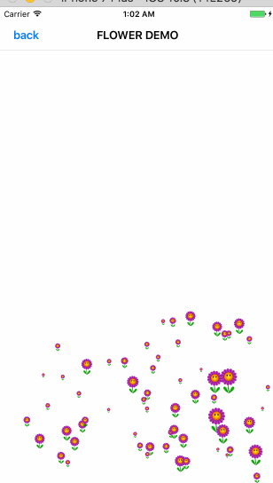
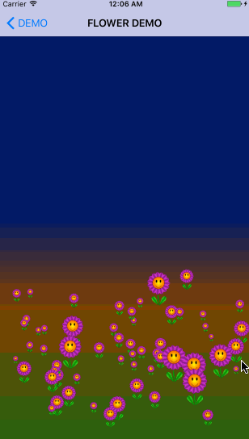
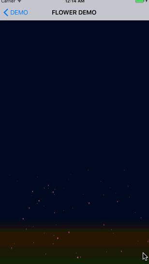
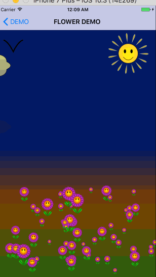

# 绘图（2）

## 图层合并及Flower生长动画

### 图层合并

图层的合并说起来很高大上，其实实际上在IOS里面实现非常的简单，实现原理就是，先获取当前的图片绘图上下文，将当前view的layer渲染到当前的绘图上下文，之后从当前的上下文中获取图片，最后结束当前上下文。返回获取到的图片

可能看代码更直观些。

<!--more-->

注：这是一个view的category方法

```objc
- (UIImage *)cy_compositedView
{
    UIGraphicsBeginImageContext(self.bounds.size);
    [self.layer renderInContext:UIGraphicsGetCurrentContext()];
    UIImage *compositedImage = UIGraphicsGetImageFromCurrentImageContext();
    UIGraphicsEndImageContext();
    
    return compositedImage;
    
}
```

### Flower 生长动画

flower的生长主要注意的地方就俩点，一个是花的位置安排，一个是花的生长动画。位置的话，需要注意的是我们希望看起来大的花和位置靠下的花，尽量能往前放。这样会有一些层次感。生长动画的话就是希望锚点能在根部，这样会有一种长起来的感觉。

还有需要注意的就是，我们这里只使用了一个Flower类，然后用这个类去生成了🌺的图片。然后采用初始化UIImageView贴图片的方式创建60朵🌺，这样能大大的节省内存空间。

代码如下

```swift
- (void)addFlowers
{
    CGFloat height = self.view.bounds.size.height;
    CGFloat width = self.view.bounds.size.width;
    
    // 花的高度
    CGFloat flowerHeight = height / 6;
    
    // 花的起始位置
    CGFloat flowerY = height * 0.3;

    // 创建花
    CYFlower *flower = [[CYFlower alloc]initWithFrame:CGRectMake(0, 0, flowerHeight * .7, flowerHeight)];
    
    // 生成花图片
    UIImage *floweimg = [flower cy_compositedView];
    
    // 贴花
    for (int i = 0; i < 60; i ++) {
        int size = height / 12.f;
        CGFloat flowersize =( arc4random() % (int) size) + size;
        
        UIImageView *flowerImgView = [[UIImageView alloc]initWithFrame:CGRectMake(arc4random()%(int)width * 0.9, arc4random() % (int)flowerY + 2 * flowerY, flowersize * .7, flowersize)];
        flowerImgView.image = floweimg;
        
        // z position设置，这样会有层次感
        flowerImgView.layer.zPosition = flowerImgView.frame.origin.y + flowersize;
        [self.view addSubview:flowerImgView];
        // 花生长
        [self growFlowers:flowerImgView duration:arc4random() % 100 / 25 + 4];
    }
    
}

- (void)growFlowers:(UIImageView *)flowers duration:(CGFloat)duration
{
    // 花锚点设置
    flowers.layer.anchorPoint = CGPointMake(.5, 1);
    
    // 添加动画
    CABasicAnimation *animation = [CABasicAnimation animationWithKeyPath:@"transform.scale"];
    animation.timingFunction = [CAMediaTimingFunction functionWithName:kCAMediaTimingFunctionEaseInEaseOut];
    animation.duration = duration;
    animation.fromValue = [NSValue valueWithCGSize:CGSizeMake(0, 0)];
    animation.toValue = [NSValue valueWithCGSize:CGSizeMake(1, 1)];
    [flowers.layer addAnimation:animation forKey:@"grow"];
}
```


下面附上生长动画



###  利用梯度layer实现太阳升起的动画

ios里面有一个layer叫CAGradientLayer，这个layer支持线性的梯度，最为关键的是，它有一个colors属性支持动画效果。我们只需要给这个colors数组里面填充颜色对象就可以了，另外我们还希望能够从起点到结束点有个过度。那么需要对startPoint属性做动画。

最后，不希望视图生成的时候就开始动画，而是在视图贴到父视图上的时候才开始动画，那么layer的动画就要加在-(void)didMoveToSuperView方法上。以下是具体实现代码

```oc
+ (Class)layerClass
{
    return [CAGradientLayer class];
}

- (void)didMoveToSuperview
{
    self.backgroundColor = [UIColor blackColor];
    CGColorRef blackcolor = [[UIColor blackColor]CGColor];
    UIColor *color1 = [UIColor colorWithRed:0.01 green:0.2 blue:0.8 alpha:1];
    UIColor *color2 = [UIColor colorWithRed:1 green:0.5 blue:0 alpha:1];
    UIColor *color3 = [UIColor colorWithRed:.35 green:.74 blue:.11 alpha:1];
    NSArray *colors = [NSArray arrayWithObjects:(id)[color1 CGColor],
                       [color2 CGColor],
                       [color3 CGColor],
                       nil];
    NSNumber *location1 = [NSNumber numberWithFloat:.0];
    NSNumber *location2 = [NSNumber numberWithFloat:.4];
    NSNumber *location3 = [NSNumber numberWithFloat:.9];
    
    CAGradientLayer *layer = (CAGradientLayer *)[self layer];
    layer.colors = colors;
    layer.locations = @[location1,location2,location3];
    layer.startPoint = CGPointMake(.5, 0);
    layer.endPoint = CGPointMake(.5, 1);
    
    CABasicAnimation *animation = [CABasicAnimation animationWithKeyPath:@"startPoint"];
    animation.duration = 6.f;
    animation.timingFunction = [CAMediaTimingFunction functionWithName:kCAMediaTimingFunctionEaseOut];
    animation.fromValue = [NSValue valueWithCGPoint:CGPointMake(.5, 1)];
    
    [layer addAnimation:animation forKey:@"start"];
    
    animation.keyPath = @"colors";
    animation.duration = 6.f;
    animation.timingFunction = [CAMediaTimingFunction functionWithName:kCAMediaTimingFunctionEaseOut];
    animation.fromValue = [NSArray arrayWithObjects:(__bridge id)blackcolor, blackcolor, blackcolor, nil];
    
    [layer addAnimation:animation forKey:@"color"];
}
@end
```

老规矩附上一张实现的效果图



### 云彩飘动

接下来，我们希望实现的是开篇的时候，展示的云朵从屏幕左侧飘移到屏幕右侧的动画，这里有几个需要注意的点

* 云朵轨迹
* 云朵投影
* 云朵投影和云朵要一起动。

实现方式的话，这里采用UIBezierPath绘制轨迹，然后内部采用梯度进行填充。云朵的投影采用云朵一半的高度绘制，然后将其设置为云朵的ShadowPath，然后利用shadowoffset属性将云朵投射到足够远的距离，形成一种投影的效果。

```objc
- (void)drawRect:(CGRect)rect
{
    CGFloat height = self.bounds.size.height;
    
    UIBezierPath *path = [self createCloudPathWithHeight:height];
    [path addClip];
    
    CGGradientRef gradientRef = [self gradientWithColor:self.innerColor toColor:self.outerColor count:2];
    CGContextRef context = UIGraphicsGetCurrentContext();
    CGPoint startPoint = CGPointMake(0, 0);
    CGPoint endPoint = CGPointMake(0, height);
    CGContextDrawLinearGradient(context, gradientRef, startPoint, endPoint, 0);
    
    path.lineWidth = self.lineThickness;
    [self.strokeColor setStroke];
    [path stroke];
    
    UIBezierPath *shadowPath = [self createCloudPathWithHeight:height / 2];
    self.layer.shadowPath = shadowPath.CGPath;
    if (!self.distance) {
        self.distance = height * 1.8;
    }
    self.layer.shadowOffset = CGSizeMake(0, self.distance);
    
    self.layer.shadowOpacity = 0.4f;
    
    self.alpha = 0.9f;
    
}

- (UIBezierPath *)createCloudPathWithHeight:(CGFloat)height
{
    CGFloat width = self.bounds.size.width;
    
    CGFloat points[] = {
        0.4,0.2,
        0.5,0.1,0.6,0.2,
        0.8,0.2,0.8,0.4,
        0.9,0.5,0.8,0.6,
        0.8,0.8,0.6,0.8,
        0.5,0.9,0.4,0.8,
        0.2,0.8,0.2,0.6,
        0.1,0.5,0.2,0.4,
        0.2,0.2,0.4,0.2,
    };
    
    CGPoint cPoint;
    CGPoint point;
    
    UIBezierPath *path = [UIBezierPath bezierPath];
    [path moveToPoint:CGPointMake(points[0] * width, points[1] * height)];
    
    for (int i = 2; i < sizeof(points) / sizeof(CGFloat); i += 4) {
        cPoint = CGPointMake(points[i] * width, points[i + 1] * height);
        point  = CGPointMake(points[i + 2] * width, points[i + 3] * height);
        [path addQuadCurveToPoint:point controlPoint:cPoint];
    }
    
    [path closePath];
    
    return path;
}
```

实现的效果图如下



### 海鸥

进行到现在，跟成品图中相差的也就剩下最后一步了，那就是海鸥的绘制，海鸥这里同样还是采用Bezier曲线绘制，不同的是，我们要采用onscreen渲染的方式，绘制出多张海鸥的image，最后将image组合成一个数组，然后用UIImageView的images数组进行展示。

以下是具体绘制代码

```objc
- (void)didMoveToSuperview
{
    if (!self.animationImages) {
        self.animationImages = [self arrayofImages];
    }
}

- (NSArray *)arrayofImages
{
    NSMutableArray *arr = [NSMutableArray arrayWithCapacity:COUNT];
    for (CGFloat i = LOWWING; i < HEIGING; i+=STEP) {
        [arr addObject:[self animationFrame:i]];
    }
    
    for (CGFloat i = HEIGING; i > LOWWING; i -= STEP) {
        [arr addObject:[self animationFrame:i]];
    }
    
    return arr;
}


- (UIImage *)animationFrame:(CGFloat)frame
{
    CGFloat width = self.bounds.size.width;
    CGFloat height = self.bounds.size.height;
    
    UIGraphicsBeginImageContextWithOptions(CGSizeMake(width, height), NO, 0);
    
    UIBezierPath *path = [UIBezierPath bezierPath];
    [path moveToPoint:CGPointMake(0, frame)];
    [path addQuadCurveToPoint:CGPointMake(.5, 0.6 - frame / 3) controlPoint:CGPointMake(.25, .25)];
    [path addQuadCurveToPoint:CGPointMake(1, frame) controlPoint:CGPointMake(.75, .25)];
    
    [path applyTransform:CGAffineTransformMakeScale(width, height)];
    path.lineWidth = height / 30;
    [path stroke];

    UIImage *imge = UIGraphicsGetImageFromCurrentImageContext();
    
    UIGraphicsEndImageContext();
    
    return imge;
}
```

效果图



### 小结

通过学习绘制图形以及给layer做动画，基本掌握了一些常用的绘制函数和动画实现方法。发现CoreGraphics确实是一个强大的图形绘制库，只要你脑洞大开就能绘制你想到的任意图形，此外图层合并能够大大节省内存空间，如果是静态的多个图层的view。可以考虑做图层渲染，渲染成图片。


## 附录

最后附上本项目在git上的demo，感兴趣的朋友可以[下载](https://github.com/TripleFireMan/GardenDemo.git)下来看看，欢迎star。