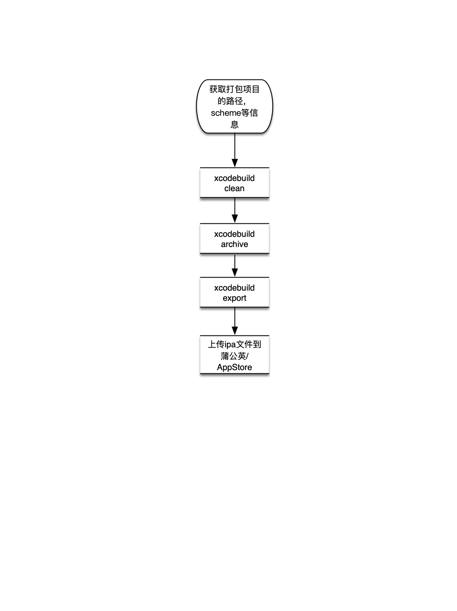

## 一、问题背景

公司是家小公司，没有成熟的打包系统，开发完app之后，往往需要开发人员用xcode打包，导出ipa文件，然后手动上传到蒲公英网站，然后把下载二维码发送给测试/老板。这里面有问题

1. 占用开发人员的时间和设备。
2. 没法做到每天都有可用的测试包，依赖开发人员打包。

3. 重复工作,每天都要做。效率低下

##二、解决方案

可以利用脚本对xcode进行打包，然后发布上传到相应的平台。

这里面，核心的功能是xcodebuild，利用这个命令行工具，可以对工程进行打包，导出。流程图如下



## 三、脚本文件

````sh
#!/bin/sh
source /etc/profile  
SECONDS=0
now=$(date +"%Y%m%d-%H:%M")
setting_path="/Users/chengyan/Desktop/setting.plist" 
# 项目名称
project_name=$(/usr/libexec/PlistBuddy -c "print project_name" ${setting_path})
echo $project_name
# 项目路径
project_path=$(/usr/libexec/PlistBuddy -c "print project_path" ${setting_path})
echo $project_path
if [ -d "${project_path}/${project_name}.xcworkspace" ];then
	# workspace_path="${project_path}/${project_name}.xcworkspace"
	workspace_path="${project_path}/${project_name}.xcworkspace"
	echo $workspace_path
else
	workspace_path="${project_path}/${project_name}.xcodeproj"
	echo $workspace_path
fi
# scheme名称
scheme_name=$(/usr/libexec/PlistBuddy -c "print scheme_name" ${setting_path})
# 项目版本
version=$(/usr/libexec/PlistBuddy -c "print version" ${setting_path})
# 开发者账号
dev_account=$(/usr/libexec/PlistBuddy -c "print dev_account" ${setting_path})
# 开发者密码
dev_password=$(/usr/libexec/PlistBuddy -c "print dev_password" ${setting_path})
# 配置打包方式
configration=$(/usr/libexec/PlistBuddy -c "print configration" ${setting_path})
# 发布地址 PGY 蒲公英 苹果商店 AppStore
upload_address=$(/usr/libexec/PlistBuddy -c "print upload_address" ${setting_path})
# ipa包名称:项目名称+版本号+打包类型
ipa_name=$(/usr/libexec/PlistBuddy -c "print ipa_name" ${setting_path})
# ipa包路径
ipa_path2=$(/usr/libexec/PlistBuddy -c "print ipa_path" ${setting_path})/${now}
ipa_path="${ipa_path2}-V${version}-${upload_address}"
# 编译build路径
archive_path="${ipa_path}/${project_name}.xcarchive"
echo ${archive_path}
# 上传到蒲公英设置
user_key=$(/usr/libexec/PlistBuddy -c "print user_key" ${setting_path})
api_key=$(/usr/libexec/PlistBuddy -c "print api_key" ${setting_path})
password=$(/usr/libexec/PlistBuddy -c "print password" ${setting_path})

# 打包方式配置
if [ ${upload_address} == 'AppStore' ]; then
	configration="Release"
	plist_path=${project_path}/exportAppStore.plist
elif [ ${upload_address} == 'PGY' ]; then
	if [ ${configration} == 'Release' ]; then
		plist_path="/Users/chengyan/Desktop/exportAdHot.plist"
	else
		plist_path=exportDevelopment.plist
	
	fi
fi

echo "=======================正在清理工程================="
xcodebuild clean -configuration ${configration} \
-workspace ${workspace_path} \
-scheme ${scheme_name} \
-quiet || exit
echo '清理完成--------》》正在编译工程:'${configration}
#通过wordspace方式打包
if [ -d "${project_path}/${project_name}.xcworkspace" ]; then
	xcodebuild archive -workspace ${workspace_path} -scheme ${scheme_name} \
	-configuration ${configration} \
	-archivePath ${archive_path} -quiet || exit
else
	xcodebuild archive -project ${project_path} - scheme ${scheme_name}\
	-configuration ${configration} \
	-archivePath ${archive_path} -quiet || exit
fi

# 检查下是否构建成功
if [ -d "$archive_path" ]; then
	echo '========项目构建成功========'
else
	echo '========项目构建失败========'
	exit 1
fi

echo '编译完成---》》---开始ipa打包'
xcodebuild -exportArchive -archivePath ${archive_path} \
-configuration ${configration} \
-exportPath ${ipa_path} \
-exportOptionsPlist ${plist_path} \
-quiet || exit

# 检查下是否导出ipa包成功
if [ -e "${ipa_path}/${ipa_name}.ipa" ]; then
	echo '========ipa 打包成功=========='
	open $ipa_path
else
	echo '=========ipa 打包失败========='
	exit 1
fi

echo '==========准备发布ipa包========='

if [ ${upload_address} == "AppStore" ]; then
	echo '准备发布包到appstore'
else
	echo '发布包到蒲公英平台'
	curl -F "file=@${ipa_path}/${ipa_name}.ipa" -F "uKey=${user_key}" -F "_api_key=${api_key}" -F "password=${password}" https://www.pgyer.com/apiv1/app/upload
	if [ $? == 0 ]; then
		echo '=====提交蒲公英成功'
	else
		echo '=====提交蒲公英失败'
	fi
fi

# 输出耗时
echo "执行时间:${SECONDS}秒"
exit 0

````


## 四、具体流程

1. 从在脚本的同级目录下，创建一个**setting.json**（名字不一定叫这个，可以自己随便起）文件，这个文件主要用来配置脚本执行的环境、上传的平台、打完包存放ipa包的路径，如果是往appstore上传的话，还需要开发者的账号，密码等信息。

   

   文件内容如下，

   ```xml
   <?xml version="1.0" encoding="UTF-8"?>
   <!DOCTYPE plist PUBLIC "-//Apple//DTD PLIST 1.0//EN" "http://www.apple.com/DTDs/PropertyList-1.0.dtd">
   <plist version="1.0">
   <dict>
   	<key>project_name</key>
   	<string>项目名称</string>
   	<key>project_path</key>
   	<string>/Users/chengyan/Desktop/工程文件目录</string>
   	<key>scheme_name</key>
   	<string>工程</string>
   	<key>version</key>
   	<string>1.6.5</string>
   	<key>upload_address</key>
   	<string>PGY</string>
   	<key>configration</key>
   	<string>Release</string>
   	<key>ipa_name</key>
   	<string>ipa包的名称</string>
   	<key>ipa_path</key>
   	<string>ipa包存放的地址</string>
   	<key>user_key</key>
   	<string>蒲公英平台userkey</string>
   	<key>api_key</key>
   	<string>蒲公英平台apikey</string>
   	<key>dev_account</key>
   	<string>苹果账号</string>
   	<key>dev_password</key>
   	<string>苹果账号密码</string>
   	<key>password</key>
   	<string></string>
   </dict>
   </plist>
   ```

2. 导出ipa配置文件

   ```sh
   xcodebuild -exportArchive -archivePath ${archive_path} \
   -configuration ${configration} \
   -exportPath ${ipa_path} \
   -exportOptionsPlist ${plist_path} \
   -quiet || exit
   ```

   

   导出ipad包的时候，需要一个ExportOption.plist文件，对应的参数为：exportOptionsPlist，这个文件用来对导出的包进行签名，配置是否要支持bitcode等信息。

   如何获取这个文件：用xcode打一次包，之后在导出的文件夹下就会有这个文件。文件内容如下图：

   


​	有了上面的两个文件之后，就可以通过运行脚本进行打包，然后把包上传到蒲公英/苹果商店了


## 五、定时打包实现DailyBuild

利用launchd命令行工具，定时执行脚本。

1. 创建一个"com.runSh.plist"json文件，用来配置启动任务，大致如下图

   

   ```html
   <?xml version="1.0" encoding="UTF-8"?>
   <!DOCTYPE plist PUBLIC "-//Apple//DTD PLIST 1.0//EN" "http://www.apple.com/DTDs/PropertyList-1.0.dtd">
   <plist version="1.0">
   <dict>
   	<key>Label</key>
   	<string>com.suoyi.service</string>
   	<key>ProgramArguments</key>
   	<array>
   		<string>/Users/chengyan/Desktop/autoIpa.sh</string>
   	</array>
   	<key>StartCalendarInterval</key>
   	<array>
   		<dict>
   			<key>Hour</key>
   			<integer>21</integer>
   			<key>Minute</key>
   			<integer>15</integer>
   		</dict>
   		<dict>
   			<key>Hour</key>
   			<integer>14</integer>
   			<key>Minute</key>
   			<integer>1</integer>
   		</dict>
   	</array>
   	<key>RunAtLoad</key>
   	<true/>
   	<key>StandardErrorPath</key>
   	<string>/Users/chengyan/Desktop/TEST.err</string>
   	<key>StandardOutPath</key>
   	<string>/Users/chengyan/Desktop/TEST.out</string>
   </dict>
   </plist>
   
   ```

   2. launchd 命令,主要用的就是load和unload命令

   ```c
   ➜  ~ launchctl list  // 获取所有定时任务
   ➜  Desktop launchctl load com.suoyi.plist // 加载任务
   ➜  Desktop launchctl list | grep com.suoyi.service // 查询当前任务的执行状态
   53241	0	com.suoyi.service
   ➜  Desktop launchctl start com.suoyi.service // 开启任务
   ➜  Desktop launchctl stop com.suoyi.service // 停止任务
   ➜  Desktop launchctl unload com.suoyi.plist // 卸载任务
   ```

   3. 注意事项：需要将脚本文件的权限修改为777。修改命令如下

   ```sh
   chmod 777 yourScrpt.sh
   ```

## 六、踩过的坑

### 1号坑： 脚本文件不能放到中文文件夹下

​	我用的是sublime2作为脚本开发工具，将脚本文件放在了我自己建的一个“脚本”文件夹下，结果编译的时候，一直报错。将脚本放到/Desktop之后，此问题解决

### 2号坑：路径一定要使用绝对路径

​	如果手动执行脚本的话，使用相对路劲也是可以的。但是利用launchctl的方式启动定时任务，那么相对路径执行就会报路径找不到的错误

### 3号坑：脚本文件不能放到".xcodeproj"目录

​	曾经误以为是pod文件出错了，把锅摔给cocoapods（正好这段时间升级了cocoapod 1.8.1）后来发现根本不是，是因为放到“.xcodeproj”这个目录下，xcode打包的时候，会报奇奇怪怪的错误。将脚本文件挪走之后，问题解决

### 4号坑：为什么使用launchd而不是crontab

​	这两都是执行定时任务的，一开始我使用的是crontab，用这个的时候，掉进了坑中坑。

#### 4.1号坑：crontab执行脚本需要配置环境变量

```
* * * * * /bin/sh test.sh ❌
* * * * * ./etc/profile; /bin/sh test.sh ✅
```

#### 4.2号坑：crontab无法对launched.keychain解锁 获取不到打包证书

​	由于这两问题，放弃crontab，而使用launchd

### 5号坑：sh代码不熟悉，if判断 没加空格，缩进等

