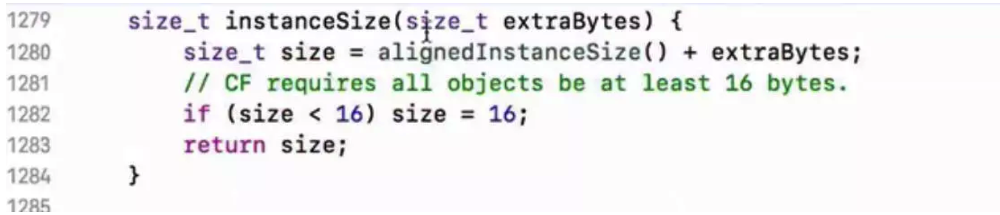
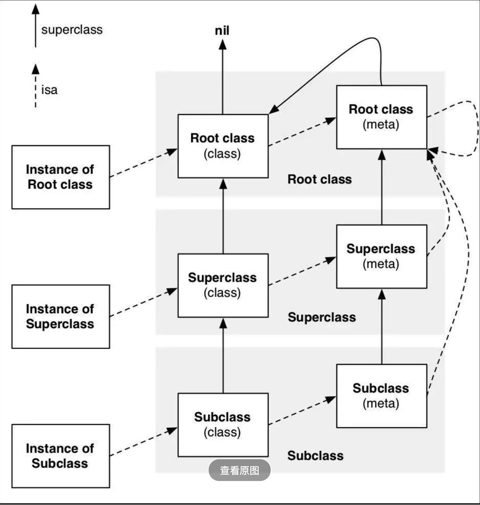

### 一、OC对象的本质

**oc的对象占多大内存空间？**

答案是16个字节，为什么是16个，一个oc对象内部只存放了一个isa指针，而在64位系统中，一个指针占据的空间是8字节，但是为了字节对齐，最小的内存空间分配为16个字节。



oc的对象，是由类创建的，类在oc里面是Class，那么Class的本质是什么？实际上class是由c的结构体构成的。**参阅runtime中的objc.h文件可知,**具体实现如下

<!---more--->

```objc
struct objc_class {
    Class _Nonnull isa  OBJC_ISA_AVAILABILITY;

#if !__OBJC2__
    Class _Nullable super_class                              OBJC2_UNAVAILABLE;
    const char * _Nonnull name                               OBJC2_UNAVAILABLE;
    long version                                             OBJC2_UNAVAILABLE;
    long info                                                OBJC2_UNAVAILABLE;
    long instance_size                                       OBJC2_UNAVAILABLE;
    struct objc_ivar_list * _Nullable ivars                  OBJC2_UNAVAILABLE;
    struct objc_method_list * _Nullable * _Nullable methodLists                    OBJC2_UNAVAILABLE;
    struct objc_cache * _Nonnull cache                       OBJC2_UNAVAILABLE;
    struct objc_protocol_list * _Nullable protocols          OBJC2_UNAVAILABLE;
#endif

} OBJC2_UNAVAILABLE;
```

每一个oc对象里面都有一个isa指针。如下

```objective-c
	struct objc_object {
    Class _Nonnull isa  OBJC_ISA_AVAILABILITY;
};
```

### 二、对象的成员变量

oc对象的成员变量，方法，协议统统都是存放在class里面。在上面的objc_class结构体中，很明显可以看到这一点。

### 三、也来聊聊isa

上一张大神图



记住一点：

1. **对象的isa指向的是：由谁创建的当前对象**。

2. **NSObject类的superclass 为nil**

3. **NSObject元类的isa指向的是它自己**

------

#### 参考文章

[ios底层原理探究](https://www.jianshu.com/p/ffd742041946)

