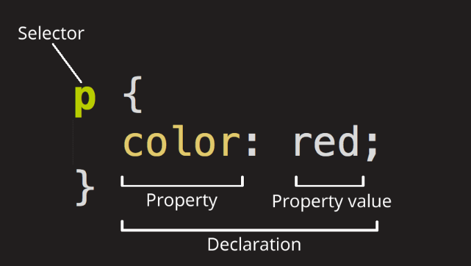

### 学习vue的第一天，从web开发开始
### 1.1 学习资料
* 学习链接[mozilla](https://developer.mozilla.org/zh-CN/docs/Web/JavaScript)
* html常用标签介绍
```html
<!doctype html>
<html lang="en-US">
  <head>
    <meta charset="utf-8" />
    <meta name="viewport" content="width=device-width" />
    <title>My test page</title>
  </head>
  <body>
    
  </body>
</html>


<!DOCTYPE html>-- 文档类型，这是比不可少的开头，混沌初开 HTML 尚在襁褓，大约是在1991-1992年，这个元素是用来关联HTML编写规范。
以供自动查错等功能所用。
<html></html>-- <html>元素，该元素包含整个页面的所有内容，有时候也称作根元素，里面包含`lang`属性，写明了页面的主要语种
<head></head>--<head>元素，所有那些你加到页面中，且不需要向用户展示的页面内容，都以这个元素为容器。其中包含诸如提供给搜索引擎的关键字和页面描述、用于设置页面样式的 CSS、字符集声明等等。
<meta charset="utf-8">——该元素指明你的文档使用 UTF-8 字符编码，UTF-8 包括世界绝大多数书写语言的字符。它基本上可以处理任何文本内容。以它为编码还可以避免以后出现某些问题，没有理由再选用其他编码。
<meta name="viewport" content="width=device-width">——视口元素可以确保页面以视口宽度进行渲染，避免移动端浏览器上因页面过宽导致缩放。
<title></title>——<title> 元素。该元素设置页面的标题，显示在浏览器标签页上，也作为收藏网页的描述文字。
<body></body>--<body> 元素。该元素包含期望让用户在访问页面时看到的全部内容，包括文本、图像、视频、游戏、可播放的音轨或其他内容。
<a href="https://www.baidu.com"></a> 超文本协议
```
* css基本原理与简单写法
  <div style="display: flex; justify-content: center">
      
  </div>

  ```css
  p {
      color: red;
  }
  ```

* 整个结构称为规则集（规则集通常简称规则），注意各个部分的名称：
  * **<p style="color:red">选择器（Selector）</p>**
    HTML 元素的名称位于规则集开始。它选择了一个或多个需要添加样式的元素（在这个例子中就是 `<p>` 元素）。要给不同元素添加样式，只需要更改选择器。

  * **<p style="color: brown">声明（Declaration）</p>**
  一个单独的规则，如 color: red; 用来指定添加样式元素的属性。
  * **<p style="color: brown">属性（Properties）</p>**
  改变 HTML 元素样式的途径（本例中 color 就是 <p> 元素的属性）。CSS 中，由编写人员决定修改哪个属性以改变规则。
  * **<p style="color: brown">属性的值（Property value）</p>**
  在属性的右边，冒号后面即属性的值，它从指定属性的众多外观中选择一个值（我们除了 red 之外还有很多属性值可以用于 color ）。
 
  ```css
  p {
    color: red;
    width: 500px;
    border: 1px solid black;
  }
  
  ```

<a style="font-size: 20px;color:red;"font-weight: bold">123</a>


