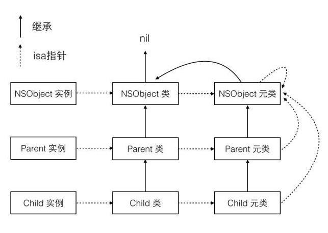
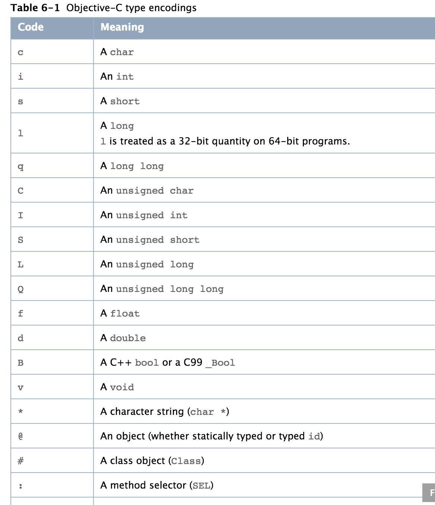

## 前言

网上讲解Runtime的教程非常之多，有些讲的还算不错，有些感觉就是人云亦云，所以读者就应该好好甄别下学习的资料。我在本文的最后，会列出一些我认为讲的不错的参考资料，以供参考。接下来就进入正文

<!--more-->

## 正文

### 理论部分

#### 基础中的基础

​	假设看官有一定的数据结构知识，知道什么叫结构体，因为接下来我要讲述的这个东西就是从结构体开始的。如果有不懂的同学请走这里[传送门](http://www.cnblogs.com/qyaizs/articles/2039101.html)

​	iOS中Class的定义如下

```objc
struct objc_class {//class 的结构体
    Class isa  OBJC_ISA_AVAILABILITY;//class的isa指向的是元类，元类的isa指向的是根元类。

#if !__OBJC2__
    Class super_class                                        OBJC2_UNAVAILABLE;//父类指针
    const char *name		                                OBJC2_UNAVAILABLE;//类名称
    long version 	                                         OBJC2_UNAVAILABLE;//类版本
    long info                                                OBJC2_UNAVAILABLE;//信息
    long instance_size                                		 OBJC2_UNAVAILABLE;//实例的大小
    struct objc_ivar_list *ivars				            OBJC2_UNAVAILABLE;//成员变量列表 
    struct objc_method_list **methodLists                     OBJC2_UNAVAILABLE;//方法列表
    struct objc_cache *cache                       		     OBJC2_UNAVAILABLE;//缓存方法
    struct objc_protocol_list *protocols                     OBJC2_UNAVAILABLE;//协议列表
#endif

} OBJC2_UNAVAILABLE;
typedef struct objc_class *Class;//此处定义了结构体指针Class
typedef struct objc_object {
    Class isa;
} *id; //此处定义了结构体指针id，id内部有一个isa Class指针，指向它的类。
```

​	isa指针是实例方法在运行时能够被执行的关键，运行时系统将依靠isa指针找到实例所在的类，进而找到方法列表和缓存方法，进行消息的发送。如果消息得不到执行，将根据类里面的super_classs指针找父类的实例方法。但是如果是类方法或者说是+号方法进行消息发送，那么将会获取类里面的isa指针进而找到元类，获取元类里面的方法列表或缓存方法进行消息处理，如果没找到，那么将去寻找元类里面的super_class指针找父元类的类方法。


​	下面是哥们从网上找的一张isa 和super_class指针的指向图



#### 基础

​	有了基础中的基础之后，我们才知道Objective-C的本源其实也是来自于C语言，来自于结构体。那么有了这些之后，怎么让OC的类和对象在我们的程序内部运作起来，接下来，有个新的东西要登场了，那就是<font color=red>**objc_msgSend**</font>，请记住它，正是有了它objective-c才真正称得上是一门面向运行时的语言。

​	objc_msgSend实质上就是一个C函数。其次objc_msgSend的参数类型第一个必须是id，第二个是SEL，第三个是va_list参数列表。从cocoa的objc.h文件中，我们可以看到它的定义。

````objc
id objc_msgSend(id self, SEL op, ...)//运行时消息发送的函数
````

​	当你以为这就是运行时发送消息的全部时，很不幸的告诉你，远远没有这么简单，objc_msgSend还有一大帮兄弟姐妹，它们如下

```objc
id objc_msgSendSuper(struct objc_super *super, SEL op, ...)//super 指针调用方法的发送的消息
void objc_msgSend_stret(id self, SEL op, ...)//当返回值是结构体时，发送此消息
void objc_msgSendSuper_stret(struct objc_super *super, SEL op, ...)//super指针调用，返回值是结构体时，发送此消息
double objc_msgSend_fpret(id self, SEL op, ...)//返回值为float类型，发送此消息(i386)
long double objc_msgSend_fpret(id self, SEL op, ...)//返回值为为float类型，发送此消息(x86_64)
```

​	其实，这些并不重要，只要掌握objc_msgSend这个就可以了，上面的这些兄弟姐妹只需要了解下就行。

#### 消息发送

​	当[obj message]调用时，将会被转化为((void (*)(id,@sel(message))objc_msgSend)(id,@sel(message))。此消息将走如下几个流程

* 检查接收的对象是否为nil，如果是，调用nil处理方案
* 在objc_object结构体中含有cache，首先会在Class的cache中查找IMP(如果没有缓存则会初始化缓存)，如果找到就会跳转到对应的函数上执行。
* 如果没有找到就像父类的Class查找，如果还没有没找到就继续向上查找，直到找到根类。
* 如果找到根类还是没有实现方案，这个时候就需要使用_objc_msgForward函数指针替代imp，最后来执行这个imp（动态方法实现）。

#### 消息转发

```objc
+ (BOOL)resolveInstanceMethod:(SEL)aSEL       //动态解析方法，给处理不了的sel动态加IMP实现
- (id)forwardingTargetForSelector:(SEL)aSelector//没有方法？那就看看谁能实现这个方法，让谁去执行下
- (NSMethodSignature *)methodSignatureForSelector:(SEL)aSelector//还是没谁能执行？那就给这个方法重新签名
- (void)forwardInvocation:(NSInvocation *)anInvocation//重新签名的方法，可以试着让转发下
```

​	理论部分到此告一段落，接下里用实践的方式，来深入的理解下这套东西

### 实践部分

#### **解归档对象**

我们知道oc的对象如果确认了NSCoding协议的话，可以将对象归档为NSData，进而存储在文件中，方便下次使用，通常的做法是将一个对象的属性一个一个的按照类型进行encode，如int型的变量，采用encodeInt:forKey,bool 型的变量，采用encodeBool:forKey。有没有一种方法不管是任何对象都可以进行归档。而不需要我们手动去辨别对象类型，进而调用相应的归档方法呢，runtime的存在对解决这类问题提供了可能。下面以归档一个CYArchieve对象为例，进行阐释。

1. ***首先第一步，获取当前对象的成员变量个数。***

   ```objc
   unsigned int count;
   Ivar *ivar = class_copyIvarList([self class], &count);
   ```

   此处调用了一个class_copyIvarList()方法，查询runtime，知道这个方法的作用如下

   ```objc
   // 根据已知的类，获取它的变量列表，outcount是这个变量列表的长度。如果一个类是nil或者没有变量列表，那么将返回NULL，且outCount将为0.注意该对象使用完之后，记得必须要free()!!!
   OBJC_EXPORT Ivar *class_copyIvarList(Class cls, unsigned int *outCount) 
       OBJC_AVAILABLE(10.5, 2.0, 9.0, 1.0);
   ```

   **调用这个方法之后，也就是说，可以获取到当前类的所有变量，和变量个数**

2. ***第二步，解析Ivar，获取变量名称***

   这里还有一个Ivar，这是什么东西？查看其定义知道，这是一个不透明的结构体指针，封装了变量类型。ø

   ```objc
   /// An opaque type that represents an instance variable.
   typedef struct objc_ivar *Ivar;

   struct objc_ivar {
       char *ivar_name         //变量名字                                 OBJC2_UNAVAILABLE;
       char *ivar_type        //变量类型                                  OBJC2_UNAVAILABLE;
       int ivar_offset        //变量在对象中的偏移量                                  OBJC2_UNAVAILABLE;
   #ifdef __LP64__
       int space  
   OBJC2_UNAVAILABLE;
   #endif
   }
   ```

   它有什么用呢？再来查找资料，苹果runtime现在已经开源，大可去其源码中找答案。

   翻翻翻，翻到runtime的定义中，找到了它的用途。Ivar有很多用途，这里我们使用到的有下面俩个

   ````objc
   // 根据获取到的Ivar结构体，获取它的名字
   OBJC_EXPORT const char *ivar_getName(Ivar v) 
       OBJC_AVAILABLE(10.5, 2.0, 9.0, 1.0);
   // 根据获取到的Ivar结构体，获取它的类型
   OBJC_EXPORT const char *ivar_getTypeEncoding(Ivar v) 
       OBJC_AVAILABLE(10.5, 2.0, 9.0, 1.0);
   ````

   这俩个方法，可以帮助我们拿到当前变量的名称和变量的类型。名称，我们知道是变量的名称。如_name _title，之类的，可是类型是什么呢？还是得靠查苹果资料，我们找到了[官方定义](https://developer.apple.com/library/content/documentation/Cocoa/Conceptual/ObjCRuntimeGuide/Articles/ocrtTypeEncodings.html#//apple_ref/doc/uid/TP40008048-CH100-SW1)下图是部分定义

   

3. ***第三步，进行归档***

   现在有了变量名称和变量类型，我们基本就可以对对象的变量进行归档了。

   头文件如下定义

   ```objc
   @interface CYArchieve : NSObject
   @property (nonatomic, copy) NSString *userName;
   @property (nonatomic, assign) const void * token;
   @property (nonatomic, assign) int length;
   @property (nonatomic, strong) NSNumber *age;
   @property (nonatomic, assign) float height;
   @end
   ```

   对此对象进行归档

   具体代码如下

   ```objc
   - (void)encodeWithCoder:(NSCoder *)aCoder
   {
       unsigned int count;
       Ivar *ivar = class_copyIvarList([self class], &count);
       for (unsigned int i = 0; i < count; i++) {
           Ivar iva = ivar[i];
           
           // 成员变量名
           const void* name = ivar_getName(iva);
           NSString *ivarName = [NSString stringWithUTF8String:name];
           
           ivarName = [ivarName substringFromIndex:1];
           
           // 获取get方法
           SEL getter = NSSelectorFromString(ivarName);
           
           // 能响应getter方法
           if ([self respondsToSelector:getter]) {
               const void *typeEncoding = ivar_getTypeEncoding(iva);//获取变量类型
               NSString *type = [NSString stringWithUTF8String:typeEncoding];//将c字符串转变为oc字符串
               
               NSLog(@"type = %@",type);
               // const void *
               if ([type isEqualToString:@"r^v"]) {
                   const void * valueUTF8 = ((const void *(*)(id ,SEL))(void *)objc_msgSend)((id)self,getter);
                   NSString *value = [NSString stringWithUTF8String:valueUTF8];
                   [aCoder encodeObject:value forKey:ivarName];
                   
                   continue;
               }
               else if ([type isEqualToString:@"f"]){
                   float fvalue = ((float(*)(id,SEL))(void *)objc_msgSend)((id)self, getter);
                   [aCoder encodeObject:@(fvalue) forKey:ivarName];
                   continue;
               }
               else if ([type isEqualToString:@"i"]){
                   int ivalue = ((int (*)(id, SEL))(void *)objc_msgSend)((id)self,getter);
                   [aCoder encodeObject:@(ivalue) forKey:ivarName];
                   continue;
               }
               id obj = ((id(*)(id, SEL))(void *)objc_msgSend)((id)self,getter);//如果是OC类型的对象，这么获取
               if (obj && [obj respondsToSelector:@selector(encodeWithCoder:)]) {//判断是否有返回值
                   [aCoder encodeObject:obj forKey:ivarName];//之后进行编码
               }
               
               /*//////////////////////////////////////////////////////////////////////////*/
               /*  将(void*)指针强制转为返回值为float类型，参数为id，sel的函数指针。
                  ((float(*)(id,SEL))(void *)objc_msgSend)((id)self, getter);
                */
               /*//////////////////////////////////////////////////////////////////////////*/
           }
       }
       free(ivar);
   }
   ```

4. ***解档和归档类似，代码如下***

   ```objc
   - (id)initWithCoder:(NSCoder *)aDecoder
   {
       self = [super init];
       if (self) {
           unsigned int count;
           Ivar *ivars = class_copyIvarList([self class], &count);
           
           for (unsigned int i = 0; i < count; i++) {
               Ivar ivar = ivars[i];
               const void * ivarName = ivar_getName(ivar);
               NSString *ivarString = [NSString stringWithUTF8String:ivarName];
               ivarString  = [ivarString substringFromIndex:1];
               NSString *setter = ivarString;
               if (![setter hasPrefix:@"_"]) {
                   char firstLatter = [setter characterAtIndex:0];
                   NSString *firstLetterString = [NSString stringWithFormat:@"%c",firstLatter];
                   setter = [setter substringFromIndex:1];
                   setter = [NSString stringWithFormat:@"%@%@",[firstLetterString uppercaseString] ,setter];
               }
               
               setter = [NSString stringWithFormat:@"set%@:",setter];
               
               SEL Sel = NSSelectorFromString(setter);
               
               if ([self respondsToSelector:Sel]) {
                   const void *typeUTF8 = ivar_getTypeEncoding(ivar);
                   NSString *type = [NSString stringWithUTF8String:typeUTF8];
                   
                   if ([type isEqualToString:@"r^v"]) {
                       NSString *value = [aDecoder decodeObjectForKey:ivarString];
                       if (value) {
                           ((void (*)(id,SEL,const void *))(void *)objc_msgSend)((id)self,Sel,value.UTF8String);
                       }
                       continue;
                   }
                   else if ([type isEqualToString:@"i"]){
                       NSNumber *number = [aDecoder decodeObjectForKey:ivarString];
                       int num = [number intValue];
                       ((void(*)(id ,SEL,int))(void *)objc_msgSend)((id)self,Sel,num);
                       continue;
                   }
                   else if ([type isEqualToString:@"f"]){
                       NSNumber *number = [aDecoder decodeObjectForKey:ivarString];
                       float flo = [number floatValue];
                       ((void(*)(id ,SEL,float))(void *)objc_msgSend)((id)self,Sel,flo);
                       continue;
                   }
                   
                   id obj = [aDecoder decodeObjectForKey:ivarString];
                   if (obj) {
                       ((void(*)(id, SEL, id))(void *)objc_msgSend)((id)self,Sel,obj);
                   }
                   
               }
           }
           
           free(ivars);
       }

       
       return self;
   }
   ```

#### **消息转发**

这一小节，我来研究下runtime里面的消息转发机制，都知道，objc_msgsend()发送之后，如果目标不能执行相应的SEL，会进入到前文我们介绍的那四个方法中，具体的实践是怎么样的呢，这里我写个demo来演示下，一方面是自己学习，另一方面也做个笔记，方便以后查阅。

1. ***动态添加方法***

   首先创建了一个CYStudent类，然后在头文件声明了一个study方法

   ```objc
   @interface CYStudent : NSObject

   - (void)study;

   @end
   ```

   但是，我们在.m文件中不实现此方法，由此来验证，是否会进入消息转发流程，之后在.m文件中实现resolveInstanceMethod:此方法，如下

   ```objc
   void play(id obj,SEL sel){
       NSLog(@"这个学生不学习，只知道玩耍！");
   }

   @implementation CYStudent

   + (BOOL)resolveInstanceMethod:(SEL)sel
   {
       if([NSStringFromSelector(sel) isEqualToString:@"study"]){
          return class_addMethod(self, sel, (IMP)play,"v@:");
       }
       return  [super resolveInstanceMethod:sel];
   }
   @end
   ```

   经如下代码测试，发现确实进入了play函数，执行结果如下

   ```objc
       CYStudent *laosan = [CYStudent new];
       [laosan study];
       
       2017-06-08 22:21:34.997 RuntimeDemo[1381:190411] 这个学生不学习，只知道玩耍！
   ```

2. ***消息转发***

   这里以CYTeacher为例，依然是让CYTeacher执行study方法，但是不给其动态解析的机会，让其将消息发送给CYStudent，CYStudent将继续动态添加方法的流程，具体实现如下

   ```objc
   @interface CYTeacher : NSObject

   @end
   @implementation CYTeacher
   + (BOOL)resolveInstanceMethod:(SEL)sel
   {
       return NO;
   }

   - (id)forwardingTargetForSelector:(SEL)aSelector
   {
       //如果转发的消息是play，老师执行不了，那就让学生对象执行下试试
       if ([NSStringFromSelector(aSelector) isEqualToString:@"study"]) {
           return [CYStudent new];
       }
       
       return [super forwardingTargetForSelector:aSelector];
   }
   @end
   /*/////////////////////////////以下为测试代码///////////////////////////////*/
       CYTeacher *teacher = [CYTeacher new];
       
       [teacher performSelector:@selector(study) withObject:nil afterDelay:0];
       
   /*/////////////////////////////以下为执行结果///////////////////////////////*/

   2017-06-08 22:31:23.541 RuntimeDemo[1457:215285] 这个学生不学习，只知道玩耍！
   ```

3. ***方法签名***

   接下来研究下方法签名和方法调用的问题，以CYDoctor为例，此处还是让CYDoctor对象执行study方法，但是不实现resolveInstanceMethod: 和forwardingTargetForSelector:这俩个方法，而是让其进入方法签名里面，生成一个方法签名，之后再执行forwardInvocation:方法。以下是我做的测试代码

   ````objc
   @interface CYDoctor : NSObject

   @end
   @implementation CYDoctor
   + (BOOL)resolveInstanceMethod:(SEL)sel
   {
       return NO;
   }

   - (id)forwardingTargetForSelector:(SEL)aSelector
   {
       return nil;
   }

   - (NSMethodSignature *)methodSignatureForSelector:(SEL)aSelector
   {
       if ([NSStringFromSelector(aSelector) isEqualToString:@"study"]) {
           return [NSMethodSignature signatureWithObjCTypes:"v@:"];
       }
       return [super methodSignatureForSelector:aSelector];
   }

   - (void)forwardInvocation:(NSInvocation *)anInvocation
   {
       [anInvocation setSelector:@selector(surgery:)];
       [anInvocation setTarget:self];
       [anInvocation invoke];
   }

   - (void)surgery:(id)sender
   {
       NSLog(@"sender : %@",sender);
       
       NSLog(@"手术中，请勿打扰!!!");
   }
   @end

   /*/////////////////////////////以下为测试代码///////////////////////////////*/
       CYDoctor *doctor = [CYDoctor new];
       
       [doctor performSelector:@selector(study) withObject:nil afterDelay:0];
       
   /*/////////////////////////////以下为执行结果///////////////////////////////*/

   2017-06-08 22:45:39.442 RuntimeDemo[1544:239413] sender : (null)
   2017-06-08 22:45:39.442 RuntimeDemo[1544:239413] 手术中，请勿打扰!!!
   ````

   经过这三个小例子，基本对objc_msgSend()的发送流程搞清楚了，接下里准备研究下MethodSwizzling

#### **MethodSwizzling**

以NSMutableArray为例，我们来替换系统的objectAtIndex：,insertObject:AtIndex:,removeObjectAtIndex:等方法。

首先我们给NSobject类添加一个category，用来给任何类进行methodSwizzling。并提供一个方法，用来交换原方法和替换方法。

```objc
#import <objc/runtime.h>


@implementation NSObject (MethodSwizzling)
+ (void)swizzlingOriginSelector:(SEL)originSel withSwizzledSelector:(SEL)swizzledSel
{
    Class class = [self class];
    Method originMethod = class_getInstanceMethod(self, originSel);
    Method swizzledMethod = class_getInstanceMethod(self, swizzledSel);
    
    // 给系统的方法，添加一个swizzledSel的实现
    BOOL didAddMethod = class_addMethod(class,
                                        originSel,
                                        method_getImplementation(swizzledMethod),
                                        method_getTypeEncoding(swizzledMethod));
    
    // 原先的方法并不存在，所以添加成功了，那么替换swiizzledSel的实现为系统原来的实现
    if (didAddMethod) {
        class_replaceMethod(class,
                            swizzledSel,
                            method_getImplementation(originMethod),
                            method_getTypeEncoding(originMethod));
    }
    else{
        method_exchangeImplementations(originMethod, swizzledMethod);
    }
    
}
```

这之后，我们创建一个NSMutableArray的category，用来执行运行时方法替换。

```objc
#import "NSMutableArray+MethodSwizzling.h"
#import <objc/runtime.h>
#import "NSObject+MethodSwizzling.h"

@implementation NSMutableArray (MethodSwizzling)
+ (void)load
{
    static dispatch_once_t onceToken;
    dispatch_once(&onceToken, ^{
        [self swizzlingOriginSelector:@selector(removeObject:) withSwizzledSelector:@selector(cy_removeObject:)];
        
        Class __NSArray_M = NSClassFromString(@"__NSArrayM");
        
        [__NSArray_M swizzlingOriginSelector:@selector(objectAtIndex:) withSwizzledSelector:@selector(cy_objectAtIndex:)];
        
        [__NSArray_M swizzlingOriginSelector:@selector(addObject:) withSwizzledSelector:@selector(cy_addObject:)];
        [__NSArray_M swizzlingOriginSelector:@selector(insertObject:atIndex:) withSwizzledSelector:@selector(cy_insertObject:atIndex:)];
        
        [__NSArray_M swizzlingOriginSelector:@selector(removeObjectAtIndex:) withSwizzledSelector:@selector(cy_removeObjectAtIndex:)];
        
    });
}

- (id)cy_objectAtIndex:(NSInteger)index
{
    NSInteger count = [self count];
    
    if (count == 0) {
        NSLog(@"array is empty");
        return nil;
    }
    
    if (index >= count) {
        NSLog(@"index is bigger than count");
        return nil;
    }
    else{
        return [self cy_objectAtIndex:index];
    }
}

- (void)cy_removeObject:(id)objec
{
    if (objec == nil) {
        NSLog(@"%s called,object is nil ,so return",__FUNCTION__);
        return;
    }
    
    [self cy_removeObject:objec];
}

- (void)cy_addObject:(id)object
{
    if (object == nil) {
        NSLog(@"%s objc cannot be nil",__FUNCTION__);
        return;
    }
    
    [self cy_addObject:object];
}

- (void)cy_insertObject:(id)anObject atIndex:(NSUInteger)index
{
    if (anObject == nil) {
        NSLog(@"%s objc cannot be nil",__FUNCTION__);
        return;
    }
    
    if (index > self.count) {
        NSLog(@"%s index %lu cannot bigger than self.count",__FUNCTION__, (unsigned long)index);
        return;
    }
    
    [self cy_insertObject:anObject atIndex:index];
    
}

- (void)cy_removeObjectAtIndex:(NSUInteger)index
{
    if (index >= self.count) {
        NSLog(@"%s index %lu cannot bigger than self.count",__FUNCTION__, (unsigned long)index);
    }
    
    [self cy_removeObjectAtIndex:index];
}

@end
```

接下来是一个例子代码，我们来验证下替换的成果。

```objc
    id nilobjc = nil;
    
    NSMutableArray *testArray = [NSMutableArray array];
    [testArray addObject:@""];
    id obj = testArray[19];
    
    [testArray insertObject:nilobjc atIndex:0];
    
    [testArray removeObject:nilobjc];
    
    [testArray addObject:nilobjc];
    
    [testArray removeObjectAtIndex:0];
```

打印结果为

```objc
2017-06-11 22:43:18.705 RuntimeDemo[38559:4195212] index is bigger than count
2017-06-11 22:43:18.705 RuntimeDemo[38559:4195212] -[NSMutableArray(MethodSwizzling) cy_insertObject:atIndex:] objc cannot be nil
2017-06-11 22:43:18.706 RuntimeDemo[38559:4195212] -[NSMutableArray(MethodSwizzling) cy_removeObject:] called,object is nil ,so return
2017-06-11 22:43:18.706 RuntimeDemo[38559:4195212] -[NSMutableArray(MethodSwizzling) cy_addObject:] objc cannot be nil
```

### 小结 

runtime的学习是持续进行了，我这篇blog也仅仅是抛砖引玉，如何灵活的在项目中使用Runtime才是我们真正应该做的。切记不可为了使用某项技术，硬刚。这是不好滴。😆

 


## 参考资料

1.[Runtime 学习笔记(一)](http://lastdays.cn/2016/02/20/runtime1/)

2.[Runtime 学习笔记(二)](http://lastdays.cn/2016/02/20/runtime2/)

3.[理解 Objective-C Runtime](http://justinyan.me/post/1624)

4.[https://github.com/CoderJackyHuang](https://github.com/CoderJackyHuang)