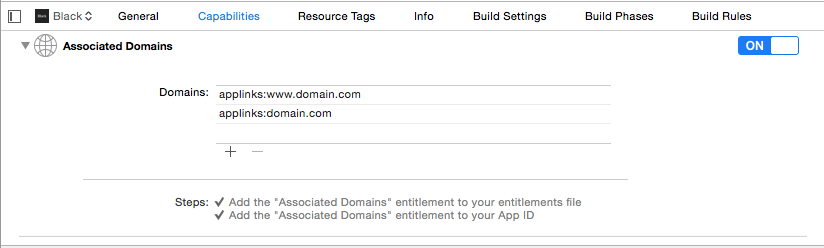
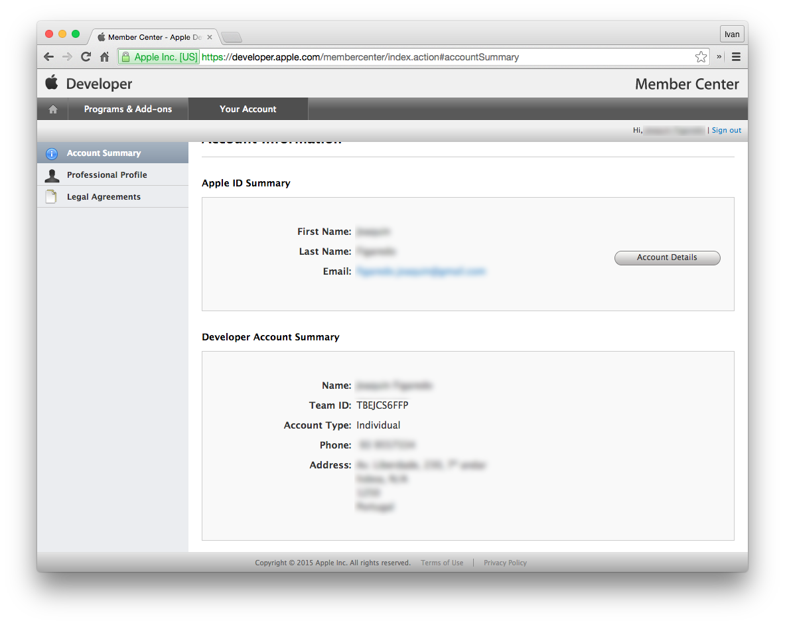
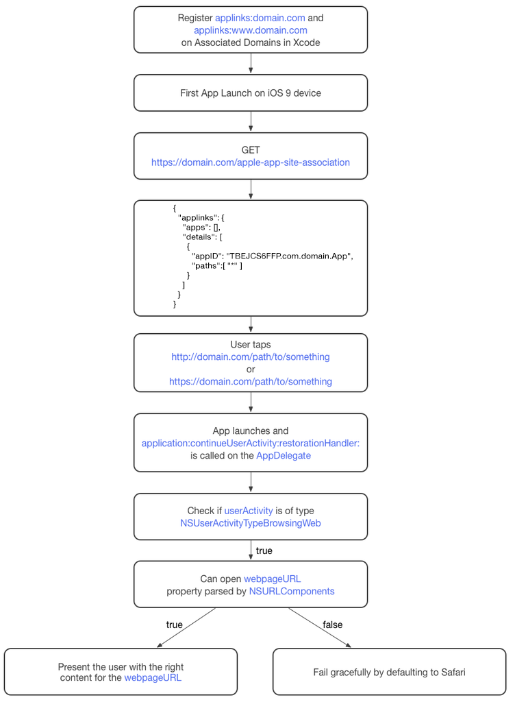

### 概述

​	在ios9系统中，可以通过类似打开网页的方式，通过http协议打开app。通过一个唯一的网址，可以指到app内部的一个特定的view。而不用再使用scheme。设想一下，如果twitter使用了Universal Link，如果你点击了一个twitter的链接。你的设备直接打开twitter app内相应的页面。而不是打开一个普通的网页，然后再通过这个网页打开twitter，这种体验将是非常平滑，且对用户来讲，也节省了很多不必要的操作。

<!--more-->

### 功能

​	使用Universal Link 能让你的App做到，通过点击一个网址，打开你的app，并跳转到对应的页面。

### 准备工作

​	实现Universal link 并不难，但是你必须遵从一些条件。下面是需要准备的清单。

| 序号   | 条件                | e.g.                       |
| ---- | ----------------- | -------------------------- |
| 1    | 注册域名              | www.domian.com             |
| 2    | 可以SSL访问你的域名       | 支持SSL方式进行文件访问              |
| 3    | 能够上传一个Json文件到你的域名 | apple-app-site-association |
| 4    | 系统版本              | ios9+                      |
| 5    | 开发环境              | Xcode7+                    |


​	  如果你已经具备了上面所有的先决条件，那么接下来只需要3步就可以在IOS9上的设备实现Universal link。

### 具体步骤

1. **添加域名到Capabilities**

   1. 首先需要在xcode的capability下面添加域名，且必须得是applinks:的前缀，如果有二级域名，也一并加入进去，诸如(www.domain.com,news.domain.com,etc)

      这将会使你的app访问一个特殊的json文件**"apple-app-site-association"**,当你首次运行app的时候，它就会从https://domain.com/apple-app-site-association 下载这个json文件。接下来，看步骤2来学习下怎么构造这个文件。

      ***此外，还需要在网站上配置app的授权，允许universal link。编辑Associate Domain的授权为enable***

2. **上传apple-app-site-assosiation 文件**

   1. 这个文件必须存在，且能通过SSL的方式，通过get请求获取到。你可以打开一个文本编辑器，然后写下如下的json格式

      ```objc
      {
        "applinks": {
          "apps": [],
          "details": [
            {
              "appID": "TBEJCS6FFP.com.domain.App",
              "paths":[ "*" ]
            }
          ]
        }
      }
      ```

      在这个path 字段下，你可以有一个列表，这个列表是app允许反射到的url地址，或者也可以是一个*号，来标示你只是想打开一个app，而不管它的具体地址。

   2. 另外，你可能会好奇**<u>”TBEJCS6FFP.com.domain.App“</u>** 这个值是从哪获取的，通常来讲，它就是你app的bundleid所在的teamed。你也可以点击[它](https://idmsa.apple.com/IDMSWebAuth/login?appIdKey=891bd3417a7776362562d2197f89480a8547b108fd934911bcbea0110d07f757&path=%2Faccount%2F&rv=1#accountSummary)来查询你的teamid,然后bundleid可以在app的General下查询到。

   3. 最后，如果你可以在你的根域名下，找到 `https://domain.com/apple-app-site-association`，那么你就可以开始下一步了。

3. **在你的app内部如何处理universallink**

   ​	为了在app内部支持universal link，你需要在appdelegate中实现以下方法，[application(_:continueUserActivity:restorationHandler:)](https://developer.apple.com/library/ios/documentation/UIKit/Reference/UIApplicationDelegate_Protocol/index.html#//apple_ref/occ/intfm/UIApplicationDelegate/application:continueUserActivity:restorationHandler:) ，尽管这个方法可能会处理多个事件（如 Handoff，SearchApi），但是我们只关注来自universal link的事件。

   ​	如果`userActivity`给的参数是`NSUserActivityTypeBrowsingWeb`.这就意味着它是来自universal link的参数，在这个情况下，首先保证它的`webpageURL`不为空，这个属性指的就是用户打开的链接。那么它有可能为如下的格式`http://domain.com/path/to/thezoo`

   ​	为了确保你的app能够转换这些URL，你需要做以下几步

   - 通过NSURLComponents类解析`webpageURL` host以及path路径。

   - 确保你能够识别这个host

   - 尽量把path的路径对应到你的app页面中

   - 确保path对应的页面能够展示

   - 展示对应的页面给用户

     如果上面的步骤失败了，苹果建议你的app，优雅的打开safari对应的网址。

### 其他

当无法往根域名下放置apple-app-site-association文件的时候，可以考虑在二级域名下放置，同时将二级域名重定向到根域名。通过这种方式也可以实现苹果启动设备的时候获取文件。

使用二级域名重定向的时候，要对apple-app-site-association文件进行加密。

而且此文件的类型应该是application/pkcs7-mime

## 常见错误


```objc
  ### Denying redirect 'https://www.domain.com/.well-known/apple-app-site-association' -> 'http://err.taobao.com/error1.html'

May 17 12:11:05 chengde-iPhone swcd(CoreUtils)[159] <Notice>: ### Rejecting URL 'https://www.domain.com/apple-app-site-association' for auth method 'NSURLAuthenticationMethodServerTrust': -6754/0xFFFFE59E kAuthenticationErr
  
```


https://forums.developer.apple.com/thread/67882 

http://stackoverflow.com/questions/34166173/apple-app-site-association-file-wont-download(解决方法)

https://gist.github.com/anhar/6d50c023f442fb2437e1#sign-the-apple-app-association-file-using-openssl（服务端和客户端需要做的事）

https://forum.ind.ie/t/ios-9-universal-links-apple-app-site-association-blues/986（一些注意事项）

### 检测工具

https://search.developer.apple.com/appsearch-validation-tool/

https://limitless-sierra-4673.herokuapp.com/

### 总结

​	最后用一张图来总结下这个流程,此外你也可以参考下[苹果的文档](https://developer.apple.com/library/content/documentation/General/Conceptual/AppSearch/UniversalLinks.html)，以备苹果更新

​	

